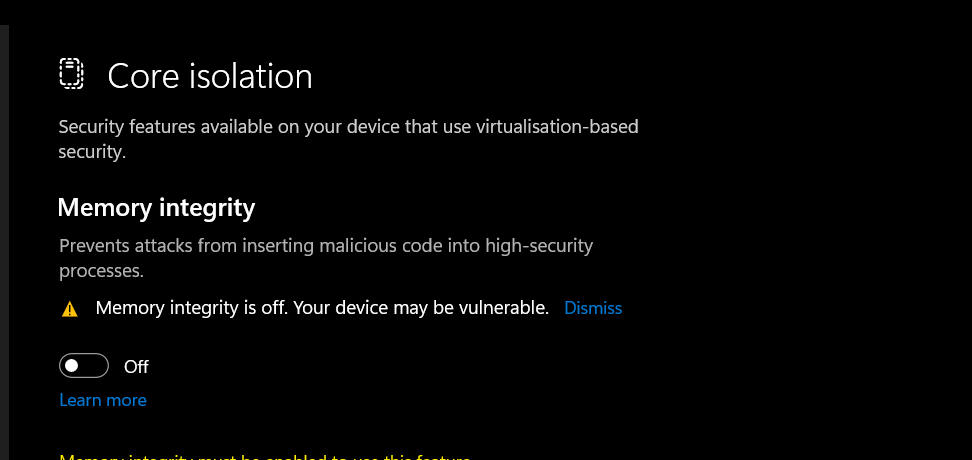
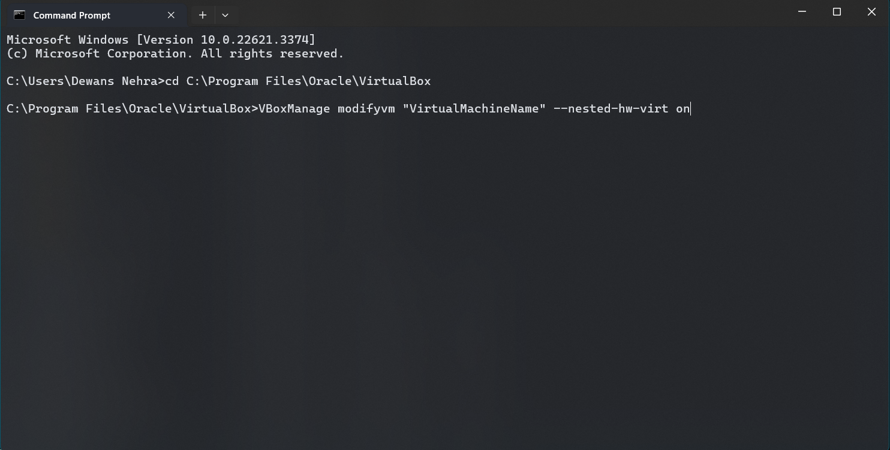
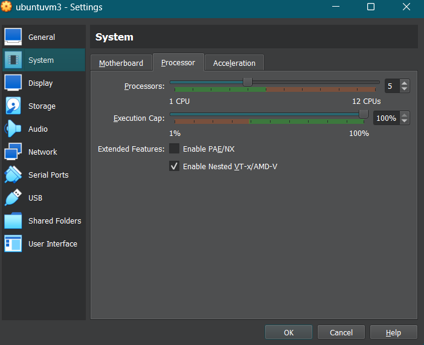
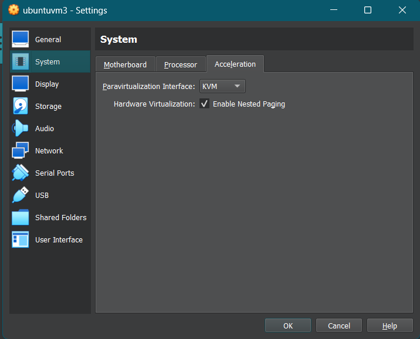
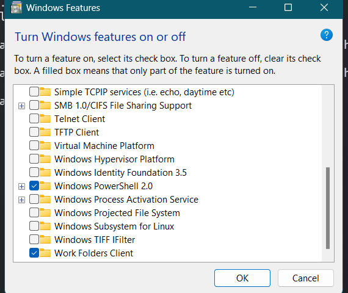

- search for `core isolation` on windows search and make sure it is turned off

</img>

- open a command prompt and run these commands (**make sure your vm is shutdown during these steps**)
    - `cd C:\Program Files\Oracle\VirtualBox`
    - `VBoxManage modifyvm "VirtualMachineName" --nested-hw-virt on`
    </img>

- now go to your vm settings and make sure the `enable vt-x/amd-v` is enabled 
    - 

- and changes these vm settings 
    - 

- now open your vm and open a terminal and run these commands 
    - `apt install cpu-checker`
    - `kvm-ok`
    - if there is a output then you are good to go

- if it does not work then try this step 
    - search for `Turn windows features on or off` and make sure the hypervisor or virtual machine is turned off
    - 

